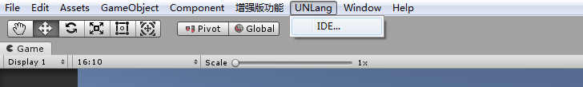
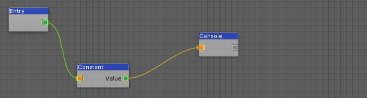
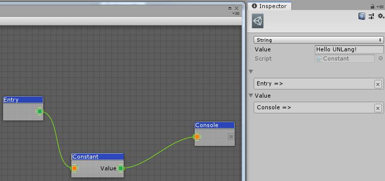
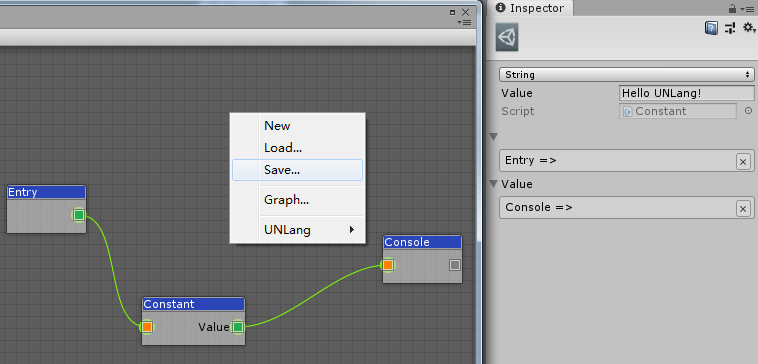

# UNLang


> Unity Node Language.

灵感来自于暴雪守望先锋团队在GDC 2017上的一篇技术演讲（[Networking Scripted Weapons and Abilities](https://www.gdcvault.com/play/1024653/Networking-Scripted-Weapons-and-Abilities)）, 之后在**Unity**中实现了一套类似的脚本系统。

## 安装

* Clone或者下载目标的二进制[发布](https://github.com/muguangyi/unlang-release)文件。（当然，你也可以自己clone代码并编译）
* 复制所有文件到Unity项目下的独立目录， 比如`[UnityProject]/Assets/UNLang`。

## 快速开始

> 让我们在Unity的console窗口中打印`Hello UNLang!`。

### ① 创建`Hello UNLang!`脚本

* 切回到Unity编辑器，你会看到`UNLang/IDE...`菜单。
  
* 打开`IDE`窗口。
* 右键点击`IDE`窗口，你会在右键菜单中看到所有可以执行的操作。
  
* 添加`Entry`，`Constant`和`Console`模块，然后如下图连接：
  
* 选中`Constant`模块，在**Inspector**窗口中选择`String`类型，然后输入`Hello UNLang!`。
  
* 在右键菜单中存储脚本到本地项目中，例如`[UnityProject]/Assets/Resources/1.bytes`。
  

### ② 执行脚本

* 在激活的场景中创建一个GameObject。
* 挂接一个空的MonoBehaviour。
* 在这个空的MonoBehaviour中添加如下代码：
  
  ```csharp
  using UnityEngine;
  using UNLang;
  using UNode;

  public class NewBehaviourScript : MonoBehaviour
  {
      // UNLang的实例，用来执行脚本。
      private LangInstance instance = null;

      void Start()
      {
          // 接管装载器，因为我们把脚本文件存放在了Resources目录下了。
          NodeLoader.Load = file =>
          {
              return Resources.Load<TextAsset>(file).bytes;
          };

          // 创建UNLang实例。
          this.instance = new LangInstance();
          // 装载脚本文件"1.bytes"。
          this.instance.Load("1");
          // 执行"Entry"模块作为入口。
          this.instance.Run<Entry>();
      }

      void Update()
      {
          // 更新UNLang实例。
          this.instance?.Update();
      }
  }
  ```

* 运行并在Unity的console窗口中看到`Hello UNLang!`，那么恭喜！

## 文档

更多例子和详细信息，请参考[Wiki](https://github.com/muguangyi/unlang/wiki).

## 维护者

[@MuGuangyi](https://github.com/muguangyi)

## 许可证

[MIT](LICENSE) @ MuGuangyi
